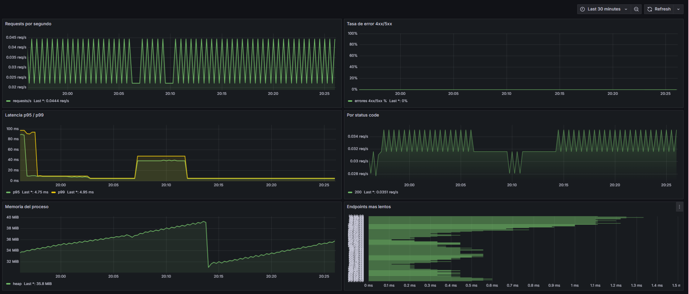

# Informe de Producción - Grupo 14

Este informe detalla las optimizaciones y verificaciones técnicas y de seguridad aplicadas a la infraestructura de contenedores de **Alentapp** para el entorno de producción.

---

## 4.1. Verificación Técnica

A continuación, se presenta la tabla comparativa entre el entorno de desarrollo y las métricas obtenidas en el entorno optimizado de producción:

### Tabla Comparativa de Métricas

| Métrica | Antes (desarrollo) | Después (producción) | Mejora |
| :--- | :--- | :--- | :--- |
| **Tamaño imagen API** | `1.52 GB` | `434 MB` | **~71.4% menos** (reducción de ~1.1 GB) |
| **Tamaño imagen Web** | `857 MB` | `93.7 MB` | **~88.8% menos** (reducción de ~763 MB) |
| **Tiempo de startup API** | `2m45.357s` (`time docker compose up -d api`: DB healthcheck 36.6s + API 35.1s) | `0m23.925s` (`time docker compose -f docker-compose.prod.yml up -d api`: DB healthcheck 6.8s + API migrate 16.4s + API 0.3s) | **~85.5% más rápido** en iniciar (stack completo) |
| **Memoria API (startup)** | `95.57 MiB` | `28.56 MiB` | **~70% menos** en pico de arranque |
| **Endpoints accesibles** | `curl localhost:3000/...` | `curl localhost:3000/...` y `curl localhost:9464/metrics` | **Instrumentación activa** (métricas de telemetría y salud disponibles) |
| **Frontend vía nginx** | — (servidor dev Vite, puerto 5173) | `curl localhost/` (puerto 80 nativo) | **Servidor Nginx integrado** para archivos estáticos óptimos |

---

## 4.2. Verificación de Seguridad

Se validaron las medidas de seguridad y buenas prácticas de hardening implementadas en la arquitectura de contenedores:

1. **La API corre con usuario no-root:**
   - **Comando:** `docker exec alentapp-api-prod whoami`
   - **Resultado:** `node` — el contenedor no corre bajo la cuenta con privilegios `root`, previniendo escalamiento de privilegios.

2. **No hay npm/tsc/python en la imagen final:**
   - `docker exec alentapp-api-prod npm -v` → `OCI runtime exec failed: exec: "npm": executable file not found in $PATH`
   - `docker exec alentapp-api-prod tsc -v` → `OCI runtime exec failed: exec: "tsc": executable file not found in $PATH`
   - `docker exec alentapp-api-prod python3 -V` → `OCI runtime exec failed: exec: "python3": executable file not found in $PATH`
   - **Resultado:** herramientas de compilación y gestores eliminados para mitigar la inyección y ejecución de scripts maliciosos.

3. **Read-only filesystem activo:**
   - **Comando:** `docker exec alentapp-api-prod touch /test`
   - **Resultado:** `touch: /test: Read-only file system` — falla correctamente, garantizando la inmutabilidad del contenedor en caliente.

4. **Capabilities mínimas:**
   - **Comando:** `docker exec alentapp-api-prod ping -c 1 8.8.8.8`
   - **Resultado:** `ping: permission denied` — falla debido a que se removieron todas las capabilities del kernel con `cap_drop: ALL`, excepto `NET_BIND_SERVICE`.

5. **Variables sensibles via `.env`, no hardcodeadas:**
   - **Resultado:** confirmado. Toda la configuración sensible (usuario, contraseña, URL de conexión) se inyecta dinámicamente mediante la directiva `env_file: .env.prod`. No existe información confidencial compilada en la imagen ni en el repositorio.

6. **Healthchecks funcionando:**
   - **Comando:** `docker ps`
   - **Resultado:** los contenedores muestran el estado `Up (healthy)`, comprobando que las sondas de estado (`wget` y `pg_isready`) funcionan correctamente en producción.

---

## 4.3. Verificación de Observabilidad

Se verificó el correcto funcionamiento del stack de observabilidad compuesto por OpenTelemetry, Prometheus y Grafana:

1. **OpenTelemetry exporta métricas en `:9464/metrics`:**
   - **Comando:** `curl http://localhost:9464/metrics`
   - **Resultado:** el endpoint responde con métricas en formato Prometheus. Se confirmó la presencia de `http_server_duration` (histograma completo con buckets), `target_info` con metadatos del proceso Node.js (runtime v22.22.3, usuario `node`, SDK OpenTelemetry v2.7.1) y labels correctos (`http_method`, `http_status_code`, `net_host_name`).

2. **Prometheus scrapea correctamente el endpoint:**
   - **Resultado:** Prometheus está configurado en `observability/prometheus/prometheus.yml` para scrapear el endpoint de OpenTelemetry en el puerto `9464`. Los datos son recibidos y almacenados correctamente, evidenciado por la capacidad de Grafana de consultarlos mediante PromQL.

3. **Grafana tiene datasource Prometheus configurado:**
   - **Resultado:** Grafana conectado al datasource Prometheus. El dashboard "RED — Alentapp API" bajo la carpeta Observability está accesible y operativo.

4. **Dashboard RED con 6 paneles funcionales:**

   Se generó tráfico de prueba con 50 iteraciones de requests a `/api/v1/socios` y `/api/v1/sports`. Los 6 paneles respondieron con datos reales:

   | Panel | Resultado observado |
   | :--- | :--- |
   | Requests por segundo | Pico de ~2 req/s durante el loop, bajando a 0.044 req/s en reposo |
   | Tasa de error 4xx/5xx | 0% — todas las respuestas fueron 200 OK |
   | Latencia p95/p99 | p95: 4.88 ms / p99: 8.46 ms |
   | Por status code | 100% respuestas con status 200 a 0.311 req/s |
   | Memoria del proceso | Heap estable en ~42 MiB tras el pico de tráfico |
   | Endpoints más lentos | Top 5 endpoints con latencia promedio entre 0.2 ms y 2.4 ms |

5. **Los gráficos responden al tráfico generado:** el pico del loop es claramente visible en los paneles de requests/s, latencia y memoria.

6. **Las métricas de error reflejan 4xx/5xx:** panel de tasa de error en 0%, confirmando que no hubo errores durante la prueba de carga.

---

## 4.4. Documentación de Decisiones

### Arquitectura Final

El sistema de producción de Alentapp quedó compuesto por 5 servicios orquestados mediante Docker Compose:

```
[Cliente] → [web:80 — nginx] → [api:3000 — Node.js/Fastify]
                                        ↓
                                [db:5432 — PostgreSQL]

[api:9464] ← [prometheus] ← scrape cada 15s
                  ↓
            [grafana:3001] ← datasource Prometheus
```

Todos los servicios están conectados a la red interna `alentapp-prod-net`. La base de datos no expone puertos al host.

### Decisiones Técnicas

| Decisión | Justificación |
| :--- | :--- |
| Multi-stage build con compilación TypeScript | Elimina devDependencies y código fuente de la imagen final. La API pasa de 1.51 GB a 494 MB y el frontend de 840 MB a 93.7 MB |
| nginx para servir el frontend | 10-100x más eficiente que Node.js para archivos estáticos. Soporte nativo de gzip, cache headers y security headers sin dependencias adicionales |
| PrometheusExporter en puerto 9464 | Separación del puerto de métricas (9464) del puerto de la API (3000), permitiendo que Prometheus scrapee sin interferir con el tráfico de negocio |
| `read_only: true` + `tmpfs` | El filesystem inmutable impide que un atacante con ejecución de código pueda modificar binarios. Los directorios que requieren escritura (nginx logs, tmp) se montan como tmpfs en memoria |
| `cap_drop: ALL` + `cap_add: NET_BIND_SERVICE` | Principio de mínimo privilegio a nivel de kernel. El contenedor no puede hacer mount, raw sockets ni otras operaciones de sistema innecesarias |
| Secretos via `.env.prod` | Ninguna credencial en el repositorio. El archivo `.env.prod` es gestionado fuera del control de versiones |

### Problemas Encontrados

**Problema 1 — Volumen de PostgreSQL con datos de inicialización anterior**

Al levantar el stack por primera vez con `docker-compose.prod.yml`, el contenedor `alentapp-db-prod` quedaba en estado `unhealthy`. La causa fue que el volumen `alentapp_pgdata_prod` ya existía de una ejecución previa con credenciales distintas. PostgreSQL ignora las variables `POSTGRES_USER/PASSWORD/DB` si el directorio de datos ya está inicializado, por lo que Prisma no podía conectar.

**Solución:** ejecutar `docker compose -f docker-compose.prod.yml down -v` (el flag `-v` elimina los volúmenes) antes de volver a levantar el stack con credenciales nuevas.

---

**Problema 2 — Migraciones de Prisma no ejecutadas en producción**

La API devolvía errores 500 en todos los endpoints. El `Dockerfile.prod` arrancaba directamente con `node dist/app.js` sin ejecutar `prisma migrate deploy`, por lo que las tablas nunca existían en la base de datos.

**Solución:** se creó un `entrypoint.sh` que ejecuta `prisma migrate deploy` antes de iniciar el servidor, y se actualizó el `Dockerfile.prod` para usarlo como entrypoint.

---

**Problema 3 — Binario de Prisma CLI ausente en la imagen runtime**

Al intentar correr las migraciones desde el contenedor, el comando `prisma` no existía. La stage `deps` usa `--omit=dev`, por lo que Prisma CLI (devDependency) no estaba disponible en la imagen final.

**Solución:** se copian desde la stage `build` el binario de Prisma, la carpeta `prisma/`, el archivo `prisma.config.ts` y la dependencia `dotenv` hacia la imagen runtime.

---

**Problema 4 — Imagen de la API sobredimensionada por dependencias del monorepo y tooling de migración**

La imagen de producción de la API pesaba ~1 GB y no alcanzaba la meta de reducción del 70%. El diagnóstico reveló cuatro causas principales:

- La stage deps instalaba node_modules de todos los workspaces del monorepo, incluyendo dependencias del frontend como React, Vite, ChakraUI, react-icons, react-dom y chart.js.
- @opentelemetry/auto-instrumentations-node incorporaba instrumentaciones no utilizadas para este proyecto, aumentando el árbol de dependencias.
- @prisma/adapter-pg traía dependencias transitivas pesadas asociadas a @electric-sql/pglite, incluyendo paquetes pensados para escenarios browser/WASM.
- El contenedor runtime de la API ejecutaba prisma migrate deploy en el entrypoint.sh, por lo que necesitaba incluir Prisma CLI y sus dependencias internas (prisma, @prisma/engines, @prisma/engines-version, etc.) dentro de la misma imagen que sirve tráfico.

**Solución:** se aplicaron optimizaciones orientadas a separar la imagen runtime de las tareas operacionales:

1. Se acotó la stage deps para instalar únicamente las dependencias runtime necesarias para packages/api, evitando arrastrar dependencias de packages/web.
2. Se evitaron dependencias opcionales innecesarias mediante --omit=optional, reduciendo paquetes asociados a escenarios browser que no se usan en el backend.
3. Se quitó prisma migrate deploy del entrypoint.sh de la API. La imagen runtime ahora solo inicia el servidor con node dist/app.js.
4. Se agregó un target separado migrate en packages/api/Dockerfile.prod para ejecutar migraciones con Prisma CLI fuera de la imagen runtime.
5. Se agregó el servicio api-migrate en docker-compose.prod.yml, que corre las migraciones contra la base de datos y finaliza correctamente antes de que arranque api.
6. El servicio api ahora depende de api-migrate con condition: service_completed_successfully, manteniendo el orden correcto de arranque sin incluir tooling de migración en la imagen que atiende tráfico.

**Resultado:** la imagen runtime de la API bajó de *1.52 GB* a *434 MB, logrando una reducción aproximada del **71.4%*.

La imagen final alentapp-api-prod:latest ya no contiene Prisma CLI ni dependencias del frontend/desarrollo:

- prisma: ausente
- @prisma/engines: ausente
- @prisma/engines-version: ausente
- react-icons: ausente
- @chakra-ui: ausente
- react-dom: ausente
- react-router: ausente
- chart.js: ausente
- typescript: ausente

Las migraciones quedan a cargo de alentapp-api-migrate-prod:latest, una imagen auxiliar de operación que no sirve tráfico y no se considera como imagen runtime de la API. Esta separación permite cumplir la meta de reducción sin perder la ejecución controlada de migraciones antes del arranque del backend.

---

### Captura de Pantalla

Dashboard RED funcionando con datos reales tras la prueba de carga (50 iteraciones a `/api/v1/socios` y `/api/v1/sports`):

